# Codebase Research Report

## Query
puedes darme la estructura en forma de arbol para mejor legibilidad

## Answer
# Estructura del Microservicio de Autenticación (auth-microservice-go.v2)

Este microservicio de autenticación en Go sigue una estructura modular, separando las responsabilidades en diferentes paquetes para una mejor organización y mantenibilidad.

## Estructura de Directorios

```mermaid
graph TB
    root["auth-microservice-go.v2<br>Root Directory<br>c:/Users/USER/Desktop/auth-microservice-go.v2/"]
    exe["Executable<br>Binary<br>auth-microservice-go.v2.exe"]
    goMod["go.mod<br>Dependency Management<br>go.mod"]
    goSum["go.sum<br>Dependency Hashes<br>go.sum"]
    mainGo["main.go<br>Entry Point<br>main.go"]
    cmdDir["cmd/<br>Command Entry Points<br>cmd/"]
    apiCmd["api/<br>API Entry Point<br>cmd/api/"]
    workerCmd["worker/<br>Worker Entry Point<br>cmd/worker/"]
    configDir["config/<br>Configuration<br>config/"]
    configYaml["config.yaml<br>Main Config File<br>config/config.yaml"]
    pkgDir["pkg/<br>Internal Packages<br>pkg/"]
    apiPkg["api/<br>API Layer<br>pkg/api/"]
    httpPkg["http/<br>HTTP Implementation<br>pkg/api/http/"]
    handlersPkg["handlers/<br>HTTP Handlers<br>pkg/api/http/handlers/"]
    serverPkg["server/<br>HTTP Server<br>pkg/api/http/server/"]
    serverGo["server.go<br>HTTP Server Definition<br>pkg/api/http/server/server.go"]
    applicationPkg["application/<br>Business Logic<br>pkg/application/"]
    portsPkg["ports/<br>Application Ports<br>pkg/application/ports/"]
    emailSenderGo["email_sender.go<br>Email Sender Interface<br>pkg/application/ports/email_sender.go"]
    servicesPkg["services/<br>Application Services<br>pkg/application/services/"]
    authServiceImplGo["auth_service_impl.go<br>Auth Service Impl<br>pkg/application/services/auth_service_impl.go"]
    authServiceGo["auth_service.go<br>Auth Service Interface<br>pkg/application/services/auth_service.go"]
    domainPkg["domain/<br>Domain Model<br>pkg/domain/"]
    entitiesPkg["entities/<br>Domain Entities<br>pkg/domain/entities/"]
    permissionEnt["permission.go<br>Permission Entity<br>pkg/domain/entities/permission.go"]
    roleEnt["role.go<br>Role Entity<br>pkg/domain/entities/role.go"]
    sessionEnt["session.go<br>Session Entity<br>pkg/domain/entities/session.go"]
    systemRoleEnt["system_role.go<br>System Role Entity<br>pkg/domain/entities/system_role.go"]
    userEmpresaRoleEnt["user_empresa_role.go<br>User Empresa Role Entity<br>pkg/domain/entities/user_empresa_role.go"]
    userEnt["user.go<br>User Entity<br>pkg/domain/entities/user.go"]
    verificationTokenEnt["verification_token.go<br>Verification Token Entity<br>pkg/domain/entities/verification_token.go"]
    repositoriesPkg["repositories/<br>Domain Repositories<br>pkg/domain/repositories/"]
    permissionRepo["permission_repository.go<br>Permission Repository<br>pkg/domain/repositories/permission_repository.go"]
    roleRepo["role_repository.go<br>Role Repository<br>pkg/domain/repositories/role_repository.go"]
    sessionRepo["session_repository.go<br>Session Repository<br>pkg/domain/repositories/session_repository.go"]
    systemRoleRepo["system_role_repository.go<br>System Role Repository<br>pkg/domain/repositories/system_role_repository.go"]
    userEmpresaRoleRepo["user_empresa_role_repository.go<br>User Empresa Role Repository<br>pkg/domain/repositories/user_empresa_role_repository.go"]
    userRepo["user_repository.go<br>User Repository<br>pkg/domain/repositories/user_repository.go"]
    verificationTokenRepo["verification_token_repository.go<br>Verification Token Repository<br>pkg/domain/repositories/verification_token_repository.go"]
    infrastructurePkg["infrastructure/<br>Implementations<br>pkg/infrastructure/"]
    authInfra["auth/<br>Auth Implementations<br>pkg/infrastructure/auth/"]
    jwtServiceGo["jwt_service.go<br>JWT Service<br>pkg/infrastructure/auth/jwt_service.go"]
    emailInfra["email/<br>Email Implementations<br>pkg/infrastructure/email/"]
    smtpEmailSenderGo["smtp_email_sender.go<br>SMTP Email Sender<br>pkg/infrastructure/email/smtp_email_sender.go"]
    messagingInfra["messaging/<br>Messaging Implementations<br>pkg/infrastructure/messaging/"]
    messagingHandlers["handlers/<br>Message Handlers<br>pkg/infrastructure/messaging/handlers/"]
    rabbitmqInfra["rabbitmq/<br>RabbitMQ Implementation<br>pkg/infrastructure/messaging/rabbitmq/"]
    persistenceInfra["persistence/<br>Persistence Implementations<br>pkg/infrastructure/persistence/"]
    postgresInfra["postgres/<br>PostgreSQL Implementations<br>pkg/infrastructure/persistence/postgres/"]
    postgresRoleRepo["role_repository.go<br>Postgres Role Repo<br>pkg/infrastructure/persistence/postgres/role_repository.go"]
    postgresUserRepo["user_repository.go<br>Postgres User Repo<br>pkg/infrastructure/persistence/postgres/user_repository.go"]
    staticDir["static/<br>Static Files<br>static/"]

    root --> |"contains"| exe
    root --> |"contains"| goMod
    root --> |"contains"| goSum
    root --> |"contains"| mainGo
    root --> |"contains"| cmdDir
    root --> |"contains"| configDir
    root --> |"contains"| pkgDir
    root --> |"contains"| staticDir

    cmdDir --> |"contains"| apiCmd
    cmdDir --> |"contains"| workerCmd

    configDir --> |"contains"| configYaml

    pkgDir --> |"contains"| apiPkg
    pkgDir --> |"contains"| applicationPkg
    pkgDir --> |"contains"| domainPkg
    pkgDir --> |"contains"| infrastructurePkg

    apiPkg --> |"contains"| httpPkg
    httpPkg --> |"contains"| handlersPkg
    httpPkg --> |"contains"| serverPkg
    serverPkg --> |"defines"| serverGo

    applicationPkg --> |"contains"| portsPkg
    applicationPkg --> |"contains"| servicesPkg
    portsPkg --> |"defines"| emailSenderGo
    servicesPkg --> |"implements"| authServiceImplGo
    servicesPkg --> |"defines"| authServiceGo

    domainPkg --> |"contains"| entitiesPkg
    domainPkg --> |"contains"| repositoriesPkg
    entitiesPkg --> |"defines"| permissionEnt
    entitiesPkg --> |"defines"| roleEnt
    entitiesPkg --> |"defines"| sessionEnt
    entitiesPkg --> |"defines"| systemRoleEnt
    entitiesPkg --> |"defines"| userEmpresaRoleEnt
    entitiesPkg --> |"defines"| userEnt
    entitiesPkg --> |"defines"| verificationTokenEnt
    repositoriesPkg --> |"defines"| permissionRepo
    repositoriesPkg --> |"defines"| roleRepo
    repositoriesPkg --> |"defines"| sessionRepo
    repositoriesPkg --> |"defines"| systemRoleRepo
    repositoriesPkg --> |"defines"| userEmpresaRoleRepo
    repositoriesPkg --> |"defines"| userRepo
    repositoriesPkg --> |"defines"| verificationTokenRepo

    infrastructurePkg --> |"contains"| authInfra
    infrastructurePkg --> |"contains"| emailInfra
    infrastructurePkg --> |"contains"| messagingInfra
    infrastructurePkg --> |"contains"| persistenceInfra
    authInfra --> |"implements"| jwtServiceGo
    emailInfra --> |"implements"| smtpEmailSenderGo
    messagingInfra --> |"contains"| messagingHandlers
    messagingInfra --> |"contains"| rabbitmqInfra
    persistenceInfra --> |"contains"| postgresInfra
    postgresInfra --> |"implements"| postgresRoleRepo
    postgresInfra --> |"implements"| postgresUserRepo
```




```
c:/Users/USER/Desktop/auth-microservice-go.v2/
├───auth-microservice-go.v2.exe  // Ejecutable compilado del microservicio.
├───go.mod                       // Define el módulo y sus dependencias.
├───go.sum                       // Contiene los hashes de las dependencias para verificación.
├───main.go                      // Punto de entrada principal de la aplicación.
├───cmd/                         // Contiene los puntos de entrada para diferentes ejecutables o modos de operación.
│   ├───api/                     // Punto de entrada para la API HTTP principal.
│   └───worker/                  // Punto de entrada para procesos de worker o tareas en segundo plano.
├───config/                      // Almacena archivos de configuración de la aplicación.
│   └───config.yaml              // Archivo de configuración principal en formato YAML.
├───pkg/                         // Contiene el código fuente de los paquetes internos reutilizables.
│   ├───api/                     // Lógica relacionada con la capa de API.
│   │   └───http/                // Implementación de la API HTTP.
│   │       ├───handlers/        // Manejadores de las rutas HTTP (controladores).
│   │       └───server/          // Configuración y arranque del servidor HTTP.
│   │           └───[server.go](pkg/api/http/server/server.go) // Define el servidor HTTP.
│   ├───application/             // Contiene la lógica de negocio de la aplicación (casos de uso).
│   │   ├───ports/               // Interfaces que definen los servicios externos requeridos por la aplicación.
│   │   │   └───[email_sender.go](pkg/application/ports/email_sender.go) // Interfaz para el envío de correos electrónicos.
│   │   └───services/            // Implementaciones de los servicios de la aplicación.
│   │       ├───[auth_service_impl.go](pkg/application/services/auth_service_impl.go) // Implementación del servicio de autenticación.
│   │       └───[auth_service.go](pkg/application/services/auth_service.go) // Interfaz del servicio de autenticación.
│   ├───domain/                  // Define el modelo de dominio (entidades y repositorios).
│   │   ├───entities/            // Estructuras de datos que representan los objetos de negocio.
│   │   │   ├───[permission.go](pkg/domain/entities/permission.go) // Entidad de permiso.
│   │   │   ├───[role.go](pkg/domain/entities/role.go)             // Entidad de rol.
│   │   │   ├───[session.go](pkg/domain/entities/session.go)       // Entidad de sesión.
│   │   │   ├───[system_role.go](pkg/domain/entities/system_role.go) // Entidad de rol de sistema.
│   │   │   ├───[user_empresa_role.go](pkg/domain/entities/user_empresa_role.go) // Entidad de rol de usuario por empresa.
│   │   │   ├───[user.go](pkg/domain/entities/user.go)             // Entidad de usuario.
│   │   │   └───[verification_token.go](pkg/domain/entities/verification_token.go) // Entidad de token de verificación.
│   │   └───repositories/        // Interfaces que definen las operaciones de persistencia para las entidades.
│   │       ├───[permission_repository.go](pkg/domain/repositories/permission_repository.go) // Repositorio de permisos.
│   │       ├───[role_repository.go](pkg/domain/repositories/role_repository.go)             // Repositorio de roles.
│   │       ├───[session_repository.go](pkg/domain/repositories/session_repository.go)       // Repositorio de sesiones.
│   │       ├───[system_role_repository.go](pkg/domain/repositories/system_role_repository.go) // Repositorio de roles de sistema.
│   │       ├───[user_empresa_role_repository.go](pkg/domain/repositories/user_empresa_role_repository.go) // Repositorio de roles de usuario por empresa.
│   │       ├───[user_repository.go](pkg/domain/repositories/user_repository.go)             // Repositorio de usuarios.
│   │       └───[verification_token_repository.go](pkg/domain/repositories/verification_token_repository.go) // Repositorio de tokens de verificación.
│   └───infrastructure/          // Implementaciones concretas de los puertos y repositorios.
│       ├───auth/                // Implementaciones relacionadas con la autenticación (e.g., JWT).
│       │   └───[jwt_service.go](pkg/infrastructure/auth/jwt_service.go) // Servicio para la gestión de JWT.
│       ├───email/               // Implementaciones para el envío de correos electrónicos.
│       │   └───[smtp_email_sender.go](pkg/infrastructure/email/smtp_email_sender.go) // Implementación de envío de correo vía SMTP.
│       ├───messaging/           // Implementaciones para la mensajería (e.g., RabbitMQ).
│       │   ├───handlers/        // Manejadores de mensajes.
│       │   └───rabbitmq/        // Implementación específica de RabbitMQ.
│       └───persistence/         // Implementaciones de los repositorios de persistencia.
│           └───postgres/        // Implementaciones de repositorios para PostgreSQL.
│               ├───[role_repository.go](pkg/infrastructure/persistence/postgres/role_repository.go) // Repositorio de roles para PostgreSQL.
│               └───[user_repository.go](pkg/infrastructure/persistence/postgres/user_repository.go) // Repositorio de usuarios para PostgreSQL.
└───static/                      // Contiene archivos estáticos (e.g., plantillas HTML para correos).
```

---
*Generated by [CodeViz.ai](https://codeviz.ai) on 7/29/2025, 3:45:41 AM*
